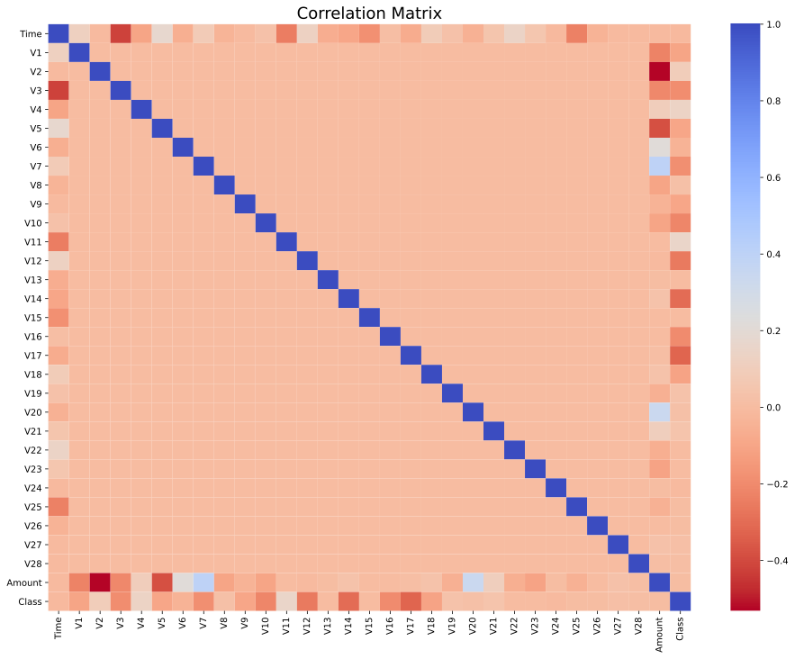
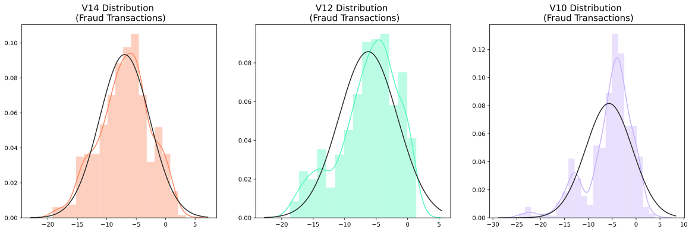

# Predicting Anamolies in Transactional Data ⚠ <!-- omit in toc -->
Many banks use Machine Learning to predict fraud in credit card transactions, but how does it work? Let's have a look at it. 🧐

# Table of Contents 📒 <!-- omit in toc -->

- [Synopsis 📝](#synopsis-)
- [What is Fraud Detection ⁉](#what-is-fraud-detection-)
- [Fraud detection techniques ✅](#fraud-detection-techniques-)
- [Challenges faced during fraud detection 💫](#challenges-faced-during-fraud-detection-)
- [Dataset 💾](#dataset-)
  - [Summary of the Dataset 📃](#summary-of-the-dataset-)
  - [Common mistakes while using Imbalanced Dataset 🚫](#common-mistakes-while-using-imbalanced-dataset-)
  - [Scaling the Dataset 🔬](#scaling-the-dataset-)
    - [Why and Where to Apply Feature Scaling❔](#why-and-where-to-apply-feature-scaling)
  - [Sub-Sampling the DataSet ➗](#sub-sampling-the-dataset-)
    - [Why do we need to create a Sub-Sample❔](#why-do-we-need-to-create-a-sub-sample)
      - [Down-Sampling 📉](#down-sampling-)
    - [Splitting the Dataset ➖](#splitting-the-dataset-)
  - [Charts and Figures 📈](#charts-and-figures-)
    - [Distribution Plot of Amount and Time 💲⏳](#distribution-plot-of-amount-and-time-)
    - [Distribution Plot of each feature 🧮](#distribution-plot-of-each-feature-)
    - [Balancing of the DataSet 📊](#balancing-of-the-dataset-)
      - [Imbalanced Data (Original)](#imbalanced-data-original)
      - [Balanced Data (After Sub-Sampling)](#balanced-data-after-sub-sampling)
    - [Correlation Matrices 🟦⬜🟥](#correlation-matrices-)
      - [Correlation (Original Dataset)](#correlation-original-dataset)
      - [Correlation (New Sampled DataSet)](#correlation-new-sampled-dataset)
    - [BoxPlots 🔳](#boxplots-)
      - [Negative Correlation](#negative-correlation)
      - [Positive Correlation](#positive-correlation)
- [References 🔍](#references-)

# Synopsis 📝

Since the early 2010s, major banks have used anomaly detection – an AI technique for identifying deviations from a norm – for automating fraud, cybersecurity, and anti-money laundering processes. According to [AI opportunity Landscape research](https://emerj.com/ai-opportunity-landscape-finserv/) by the [Emerj](https://emerj.com/), *approximately 26% of the venture funding raised for AI in the banking industry is for fraud and cybersecurity applications, more than any other use-case category.*

# What is Fraud Detection ⁉

Fraud detection is a set of activities undertaken to prevent money or property from being obtained through false pretenses. Fraud detection is applied to many industries such as banking or insurance. In banking, fraud may include forging checks or using stolen credit cards. Other forms of fraud may involve exaggerating losses or causing an accident with the sole intent for the payout.

Banking Fraud has been an ever-developing issue with enormous outcomes to banks and clients the same, both regarding monetary misfortunes, trust and believability. According to the Nilson report, it is foreseen that card fraud alone would add up to an astounding $30 billion worldwide by 2020. Additionally, with the innovation disturbance in both banking and installments (because of plenty of installment channels like credit/charge cards, cell phones, kiosks), the quantity of exchanges has expanded exponentially as of late. Fraudsters have additionally gotten incredibly shrewd, receiving innovatory fraud strategies. Accordingly it has intensified the issue.

# Fraud detection techniques ✅

Fraud detection can be separated by the use of statistical data analysis techniques or artificial intelligence (AI).

Statistical data analysis techniques include the use of:

- Calculating statistical parameters
- Regression analysis
- Probability distributions and models.
- Data matching

AI techniques used to detect fraud include the use of:
1. Data mining - Which can classify, group and segment data to search through up to millions of transactions to find patterns and detect fraud.
2. Neural networks - Which can learn suspicious-looking patterns, and use those patterns to detect them further.
3. Machine learning- Which can automatically identify characteristics found in fraud.
4. Pattern recognition- Which can detect classes, clusters and patterns of suspicious behavior.

We will be focusing using Machine Learning to detect fraud.

# Challenges faced during fraud detection 💫

 - A large number of transactions and data processed every day. 
 - 99.8% of transactions are not fraudulent which makes it hard to extract and learn features for fraudulent ones, making the data imbalanced.
 - Finding a real dataset as it is mostly kept private and safe.
 - Misclassified data as not every fraudulent transaction are being reported and caught.
 - Adaptive techniques used against the model by the scammers.

# Dataset 💾

The datasets contains transactions made by credit cards in September 2013 by European cardholders.
This dataset presents transactions that occurred in two days, where we have 492 frauds out of 284,807 transactions. The dataset is highly unbalanced, the positive class (frauds) account for 0.172% of all transactions

It contains only numerical input variables which are the result of a PCA transformation. Features V1, V2, … V28 are the principal components obtained with PCA, the only features which have not been transformed with PCA are 'Time' and 'Amount'. Feature 'Time' contains the seconds elapsed between each transaction and the first transaction in the dataset. The feature 'Amount' is the transaction Amount, this feature can be used for example-dependant cost-sensitive learning. Feature 'Class' is the response variable and it takes value 1 in case of fraud and 0 otherwise.

## Summary of the Dataset 📃

 - Transaction amounts are relatively small, averaging at **USD 88.349619**.
 - No `Null` values.
 - **99.83%** of transactions were **non-fraud** and **0.17%** of transactions were fraud, making the data Imbalanced.
 - The description of the data says all the features, except time and amount went through **PCA Transformation** (Dimensionality Reduction technique). Keeping in mind that in order to implement PCA Transformation, features are needed to be scaled so I will be assuming all the ***V*** features have been scaled.

## Common mistakes while using Imbalanced Dataset 🚫

- Testing on oversampled/undersampled dataset.
- Implementing cross-validation after oversampling/undersampling the training data. It needs to be **during** the fact.
- Using accuracy score as the metric. Use f1-score, precision, recall and confusion matrix instead.

## Scaling the Dataset 🔬

Feature scaling, also known as Standardization is a step of Data Pre Processing which is applied to independent variables or features of data. It helps to normalize the data within a particular range. Sometimes, it also helps in speeding up the calculations in an algorithm.

### Why and Where to Apply Feature Scaling❔

The real-world dataset contains features that highly vary in magnitudes, units, and range. Normalization should be performed when the scale of a feature is irrelevant or misleading and not should Normalise when the scale is meaningful.

We need to scale the columns `Time` and `Amount`.

## Sub-Sampling the DataSet ➗

In classification problems, a disparity in the frequencies of the observed classes can have a significant negative impact on model fitting. One technique for resolving such a class imbalance is to subsample the training data in a manner that mitigates the issues.

According to our use-case scenario, subsampling is a process to make the ratio of Positive and Negative features to 50-50 so that we have equivalent Fraudulent and Non-Fraudulent Transactions.

### Why do we need to create a Sub-Sample❔

As we can see in the charts below, the original data is heavily imbalanced. It can cause two major problems: 

- *Overfitting:* Our model will assume that there are no frauds and will be uncertain.
- *Wrong Correlations:* Although we don't know what `V` stands for, it will be useful to understand how each of these features would influence the results.

#### Down-Sampling 📉

Making a Random subset of the apparent multitude of classes in the training set so their class frequencies coordinate the least common class. For instance, assume that 80% of the preparation set examples are the top of the line and the staying 20% are in the second class. Down-Sampling would randomly sample the first class to be a similar size as the second class (with the goal that only 40% of the complete preparing set is utilized to fit the model).

### Splitting the Dataset ➖

Before undersampling the Dataset, we have to separate the original dataset as we need to test the model on the real test dataset and not our modified dataset to check its real-world performance.

## Random Under-Sampling the DataSet ✂

As we can see in [this](#imbalanced-data-original) figure, there is a huge imbalance between fraudulent and non-fraudulent transactions (99.83% and 0.17%). 

Random undersampling involves randomly selecting examples from the majority class and deleting them from the training dataset.

To achieve this, 

- We first notice that there are 492 Fraudulent transactions and we need to bring the Non-Fradulent transaction to the same amount to make the 50-50 ratio we need.
- Now we would shuffle the data to make sure that the data is equally distributed and not skewed towards one side due to the sub-sample we choose.

*Note: *

## Charts and Figures 📈

### Distribution Plot of Amount and Time 💲⏳

Will tell us about the Skewness of the data and where does the data incline towards?

### Distribution Plot of each feature 🧮
Plotting histograms with their distribution of each feature (Time + V1-V27) to see the difference between Fraudulent and Non-Fraudulent transactions.

### Balancing of the DataSet 📊

#### Imbalanced Data (Original)

#### Balanced Data (After Sub-Sampling)

### Correlation Matrices 🟦⬜🟥

A correlation matrix is a table showing correlation coefficients between variables. Each cell in the table shows the correlation between the two variables. A correlation matrix is used to summarize data, as an input into a more advanced analysis, and as a diagnostic for advanced analyses.

#### Correlation (Original Dataset)

#### Correlation (New Sampled DataSet)

So we can see that: 

- V17, V14, V12 and V10 are negatively correlated, the lower they are, the higher are the chances for that transaction to be a fraud.
- V2, V4, V11, V19 are positively related, the higher they are, the higher are the chances for that transaction to be a fraud.

### BoxPlots 🔳

A boxplot is a standardized way of displaying the distribution of data based on a five-number summary (“minimum”, first quartile (Q1), median, third quartile (Q3), and “maximum”). It can tell you about your outliers and what their values are. It can also tell you if your data is symmetrical, how tightly your data is grouped, and if and how your data is skewed.

#### Negative Correlation

#### Positive Correlation

### Distribution plot of V14, V12, V10 (Fraud Transactions) 🗻

# References 🔍

1. [Fraud Detection, definition](https://searchsecurity.techtarget.com/definition/fraud-detection)
2. [AI-Based Fraud Detection in Banking – Current Applications and Trends](https://emerj.com/ai-sector-overviews/artificial-intelligence-fraud-banking/#:~:text=Banks%20can%20use%20predictive%20analytics,involve%20a%20separate%20processing%20service.)
3. [Credit Card Fraud Detection in Python using Scikit Learn](https://medium.com/analytics-vidhya/credit-card-fraud-detection-in-python-using-scikit-learn-f9046a030f50)
4. [Fraud Detection in the Banking Industry and the Significance of Machine Learning](https://medium.com/engineered-publicis-sapient/fraud-detection-in-banking-industry-and-significance-of-machine-learning-dfd31891a0b4)
5. [ML | Credit Card Fraud Detection](https://www.geeksforgeeks.org/ml-credit-card-fraud-detection/)
6. [Credit Card Fraud Detection Dataset: Kaggle](https://www.kaggle.com/mlg-ulb/creditcardfraud/data#)
7. [Kaggle: Dealing with imbalanced datasets](https://www.kaggle.com/janiobachmann/credit-fraud-dealing-with-imbalanced-datasets)
8. [Python | How and where to apply Feature Scaling?](https://www.geeksforgeeks.org/python-how-and-where-to-apply-feature-scaling/)
9. [Subsampling For Class Imbalances](https://topepo.github.io/caret/subsampling-for-class-imbalances.html)
10. [What is a Correlation Matrix?](https://www.displayr.com/what-is-a-correlation-matrix/#:~:text=A%20correlation%20matrix%20is%20a,a%20diagnostic%20for%20advanced%20analyses.)
11. [Understanding Boxplots](https://towardsdatascience.com/understanding-boxplots-5e2df7bcbd51)
12. [How to Remove Outliers for Machine Learning](https://machinelearningmastery.com/how-to-use-statistics-to-identify-outliers-in-data/)
13. [Random Oversampling and Undersampling for Imbalanced Classification](https://machinelearningmastery.com/random-oversampling-and-undersampling-for-imbalanced-classification/#:~:text=Random%20undersampling%20involves%20randomly%20selecting,more%20balanced%20distribution%20is%20reached.)